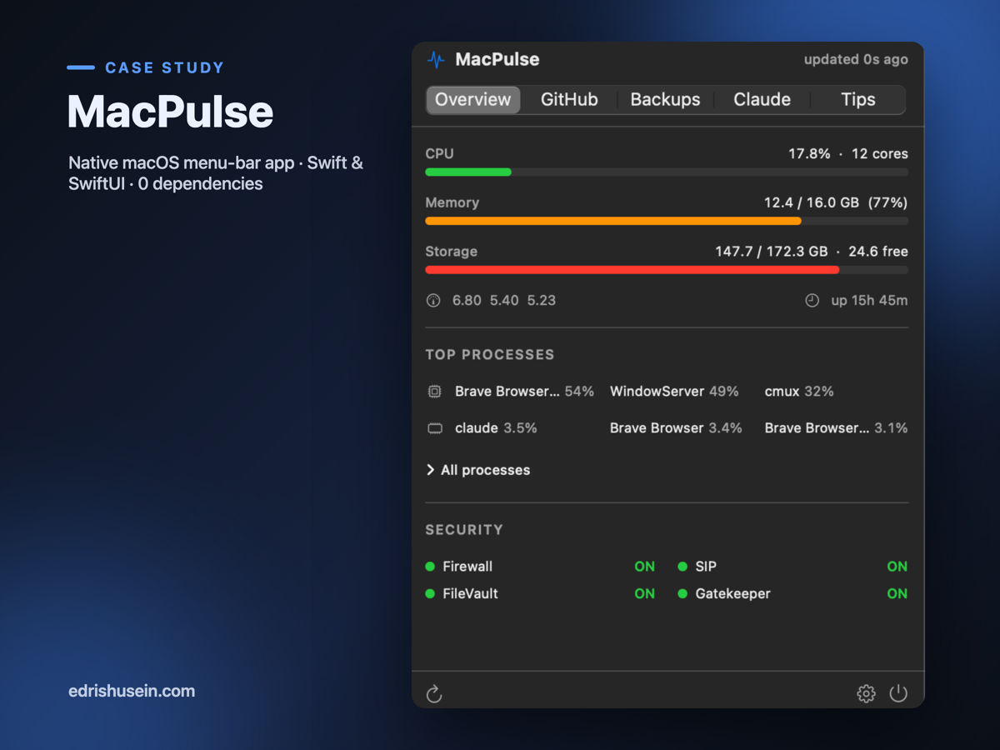

# MacPulse



A native macOS menu bar app that keeps your machine's health and your GitHub presence one click away — with live CPU/memory/disk readouts right in the menu bar. Written in pure Swift/SwiftUI with **zero third-party dependencies** — the whole app weighs under 600 KB.


## What it shows

**Overview tab**
- CPU usage (live, read from the kernel via `host_statistics` — matches Activity Monitor)
- Memory used/total with pressure coloring (`vm_statistics64`, Activity Monitor formula)
- Storage used/free for the boot volume, purgeable-aware (matches Finder, not `df`)
- Load average, uptime, top 3 processes by CPU and by RAM
- **Process management** — expand to the full process list, sort by CPU or memory, and Quit / Force Quit any process (Activity-Monitor style) behind a confirmation dialog; root-owned processes fail gracefully (no sudo prompt)
- Security audit: Firewall, FileVault, SIP, Gatekeeper — red dot when something is off

**GitHub tab**
- Contributions this year, current streak, days active this week, contributed-today flag
- Public repos, followers, last 5 public events (pushes, PRs, branches, issues)
- **Optional sign-in** — if you're already logged into the `gh` CLI, MacPulse borrows that token to show your private repo count plus a recent-commits list (repo · message · time, with a private/public badge; click to open the commit). Entirely opt-in: the token is held in memory only and never written to disk, private commit details are stripped before anything is cached, and it falls back to public-only if `gh` isn't logged in

**Backups tab**
- Health of the local backup automation: overall status, the two launchd jobs (loaded state, last run, exit code), projects covered, failures, restore-drill result, tracked-secret hits, and Drive/SSD/Mac disk figures
- **Reveal in Finder** for the Google Drive and SSD backup destinations (disabled when a destination isn't mounted) and **open-log** buttons for each launchd job, plus extra stats (archived today, claude copies, ran-today, restore-drill detail)
- Reads the collector's local `status.json` directly — no network, no login, nothing leaves the Mac
- Shows a friendly empty state if the backup tooling isn't set up on this machine

**Claude Code tab**
- Subscription-limit gauges for the 5-hour, 7-day, and weekly windows — each showing % used and a reset countdown
- Activity stats for today, last 7 days, last 30 days, and all time (messages + tokens)
- Per-project breakdown so you can see where usage is concentrated
- Manual reload button with a "last updated X ago" timestamp; refreshes automatically when the tab opens
- Reads local Claude Code transcripts (`~/.claude/projects/**/*.jsonl`) plus one live call to the Anthropic usage API — nothing is written to disk, the OAuth token is held in memory only

**Tips tab**
- Rule-based improvement findings sorted by severity: disk almost full, RAM pressure, security features disabled, long uptime
- On-demand storage hotspot scan (Caches / Trash / Downloads sizes) with one-click reveal
- **Scan large files** — on-demand walk of your home folder (skips ~/Library, hidden dirs, and symlinks) listing files ≥100 MB, each with Reveal in Finder
- Deep links straight into the relevant System Settings pane

**Menu bar** — pick any of CPU %, memory %, and disk % to show live next to the clock (Stats-app style); toggle each in Settings. Plus a launch-at-login option.

## Install

```bash
git clone https://github.com/Husein-Edris/MacPulse.git
cd MacPulse
make install   # builds, signs, copies to /Applications
open /Applications/MacPulse.app
```

Requires macOS 13+ and the Xcode Command Line Tools (`xcode-select --install`). No Xcode, no Homebrew, no package managers needed.

### Other targets

```bash
make test    # run the unit test suite (parsers, scoring, rules engine)
make app     # build dist/MacPulse.app without installing
make run     # build and launch from dist/
make clean
```

> Note: with Command Line Tools only, the Makefile drives `swiftc` directly because CLT's SwiftPM cannot resolve the platform path. On a machine with full Xcode, plain `swift build` also works via `Package.swift`.

## Design decisions

| Concern | Choice |
|---|---|
| Size | Single native binary, no bundled runtime — under 600 KB total vs. 100+ MB for an Electron equivalent |
| Energy | Kernel reads are microseconds; timers carry tolerance so the OS can coalesce wakeups; the menu-bar sample backs off automatically on battery (every 12s vs. 5s on AC); the heavier process scan runs only while the popover is open; storage and large-file scans only run when you ask |
| Security | Hardened-runtime code signing; no token is ever stored — GitHub fetches use an ephemeral session, optional sign-in borrows the `gh` CLI token in memory only, and private commit data is redacted before anything is cached |
| Privacy | Unauthenticated by default, talking only to public github.com endpoints; sign-in is opt-in and nothing private is ever written to disk |
| Practicality | Lives in the menu bar, one click to everything, launch-at-login toggle |

## Architecture

```
Sources/MacPulse/
├── MacPulseApp.swift      MenuBarExtra entry point
├── AppState.swift         Central ObservableObject: timers, caching, settings
├── SystemMonitor.swift    CPU/RAM/disk/uptime/processes (mach + sysctl)
├── PowerSource.swift      AC vs. battery detection (IOKit) → sample interval
├── ProcessParser.swift    Pure `ps` parsing (unit-tested), separated from I/O
├── ProcessControl.swift   Quit / Force Quit via the kill(2) syscall
├── FileScanner.swift      Home-folder large-file scan + pure ranker (unit-tested)
├── SecurityAudit.swift    Firewall/FileVault/SIP/Gatekeeper via system CLIs
├── GitHubParser.swift     Pure parsing (unit-tested), separated from I/O
├── GitHubAuth.swift       Optional `gh` CLI token (in-memory only)
├── GitHubService.swift    Ephemeral URLSession fetches
├── BackupStatus.swift     Pure status.json model + parser (unit-tested)
├── BackupService.swift    Local status.json file read
├── BackupLocations.swift  Resolves Drive/SSD/log paths for reveal-in-Finder
├── MenuBarRenderer.swift  Stacked CPU/RAM/SSD menu-bar image (AppKit)
├── ImprovementsEngine.swift  Pure rules engine (unit-tested)
├── StorageScanner.swift   On-demand du-based hotspot sizing
└── Views/                 SwiftUI: Overview, GitHub, Backups, Tips, Settings
```

All business logic (parsing, scoring, rules) is pure functions with no I/O, covered by the test runner in `Tests/TestRunner`.

## History

MacPulse replaces a set of Bash monitoring scripts (terminal dashboard + cron-style daemon) that lived in this repo before; they're preserved in [`legacy/`](legacy/) with their original README.

## License

MIT
